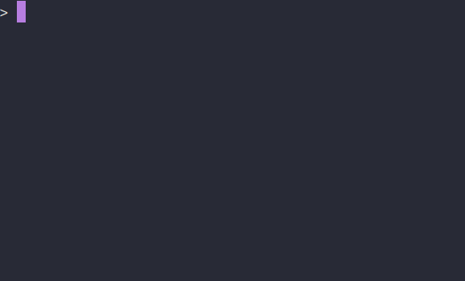

# gokeepasspoc

Proof of concept of using Go to manipulate a kdbx file



## Usage

```bash
PASSDB=example.kdbx go run cmd/fzf/*
```

The password is `password`

## Credits

Thanks to :
- [gokeepasslib](https://github.com/tobischo/gokeepasslib)
- [fzf](https://github.com/junegunn/fzf)
